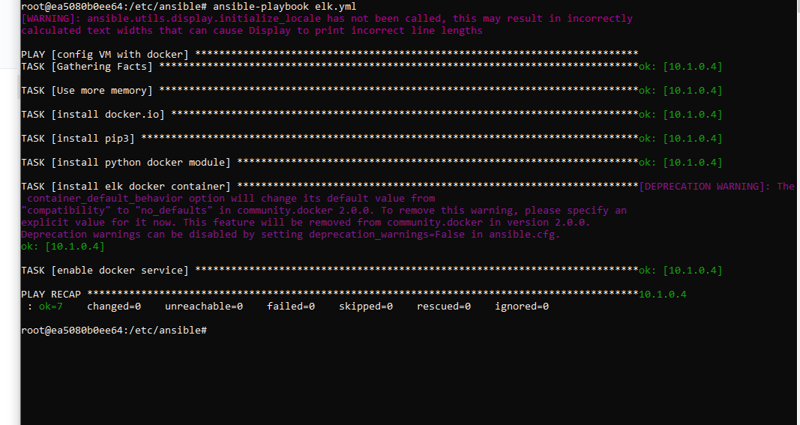
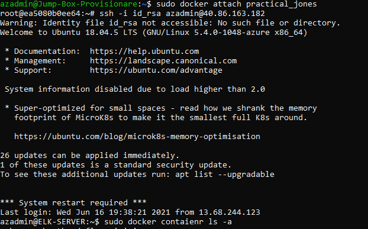

# CS-Project-1
Automated ELK Stack Deployment

The files in this repository were used to configure the network depicted below.

These files have been tested and used to generate a live ELK deployment on Azure. They can be used to either recreate the entire deployment pictured above. Alternatively, select portions of the elk installation playbook may be used to install only certain pieces of it such as Filebeat.
  
  -
  
This document contains the following details:
- Description of the Topology
- Access Policies
- ELK Configuration
  - Beats in Use
  - Machines Being Monitored
- How to Use the Ansible Build

Description of the Topology

The main purpose of this network is to expose a load-balanced and monitored instance of DVWA, the D*mn Vulnerable Web Application.

Load balancing ensures that the application will be highly Available, in addition to restricting inbound access to the network.

What aspect of security do load balancers protect? What is the advantage of a jump box?
	

Integrating an ELK server allows users to easily monitor the vulnerable VMs for changes to the files systems of the VMs on the network and watching the system metrics.
-What does Filebeat watch for? Filebeat monitors the log files or locations that you specify, collects log events, and forwards them either to Elasticsearch or Logstash for indexing
- What does Metricbeat record? Metricbeat records the metrics and statistics that it collects and ships them to the output that you specify, such as Elasticsearch or Logstash.

The configuration details of each machine may be found below.

| Name     | Function   | IP Address | OS    |
|----------|------------|------------|-------|
| Jump-Box | Gateway    | 10.0.0.8   | Linux |
| Web 1    | Web server | 10.0.0.6   | Linux |
| Web 2    | Web server | 10.0.0.7   | Linux |
| ELK      | Monitoring | 10.1.0.4   | Linux |

Access Policies

The machines on the internal network are not exposed to the public Internet. 

Only the JumpBox machine can accept connections from the Internet. Access to this machine is only allowed from the following IP addresses: 74.129.181.226

Machines within the network can only be accessed by Each other. Web 1 and Web 2 Virtual machines send traffic to the ELK server

A summary of the access policies in place can be found in the table below.
| Name     | Publicly Accessible | Allowed IP Addresses |
|----------|---------------------|----------------------|
| Jump-Box | Yes                 | 79.129.181.226       |
| Web 1    | no                  | 10.0.0.5-510         |
| Web 2    | no                  | 10.0.0.5-510         |
| ELK      | no                  | 10.0.0.5-510         |

Elk Configuration

Ansible was used to automate configuration of the ELK machine. No configuration was performed manually, which is advantageous because...
- What is the main advantage of automating configuration with Ansible? The main advantage is that it 100% automates the process which saves you time from having to do it manually and you are able to shift focus elsewhere.

The playbook implements the following tasks:
-The hosts and users are designated

-Docker is installed

-pip3 is installed

-Docker Python module is installed

-More memory is added to the machines 

-A Docker ELK container is downloaded 

The following screenshot displays the result of running `docker ps` after successfully configuring the ELK instance.

Target Machines & Beats
This ELK server is configured to monitor the following machines: Web1 and Web2 VM
-Web-1 VM 10.0.0.6
-Web-2 VM 10.0.0.7

We have installed the following Beats on these machines:
- Filebeat
-Metricbeat

These Beats allow us to collect the following information from each machine:
Filebeat detects changes in the filesystem. Which we will use to collect Apache logs, while metricbeat Metricbeat detects changes in system metrics. It will collect metrics from the operating system and from services running on the server

### Using the Playbook
In order to use the playbook, you will need to have an Ansible control node already configured. Assuming you have such a control node provisioned: 

SSH into the control node and follow the steps below:
- Copy the installation playbook file to a .yml file in your /etc/ansible directory inside the ansible container.
- Update the host file to in the ansible to include the correct host and groups and add ansible_python_interpreter=/usr/bin/bash
-
- Run the playbook, and navigate to http://40.86.163.182:506/app/kibana to check thatht the installation worked as expected.

_TODO: Answer the following questions to fill in the blanks:_
- Which file is the playbook?
-Where do you copy it?_
- _Which file do you update to make Ansible run the playbook on a specific machine? How do I specify which machine to install the ELK server on versus which to install Filebeat on?_
- _Which URL do you navigate to in order to check that the ELK server is running?

_As a **Bonus**, provide the specific commands the user will need to run to download the playbook, update the files, etc._
